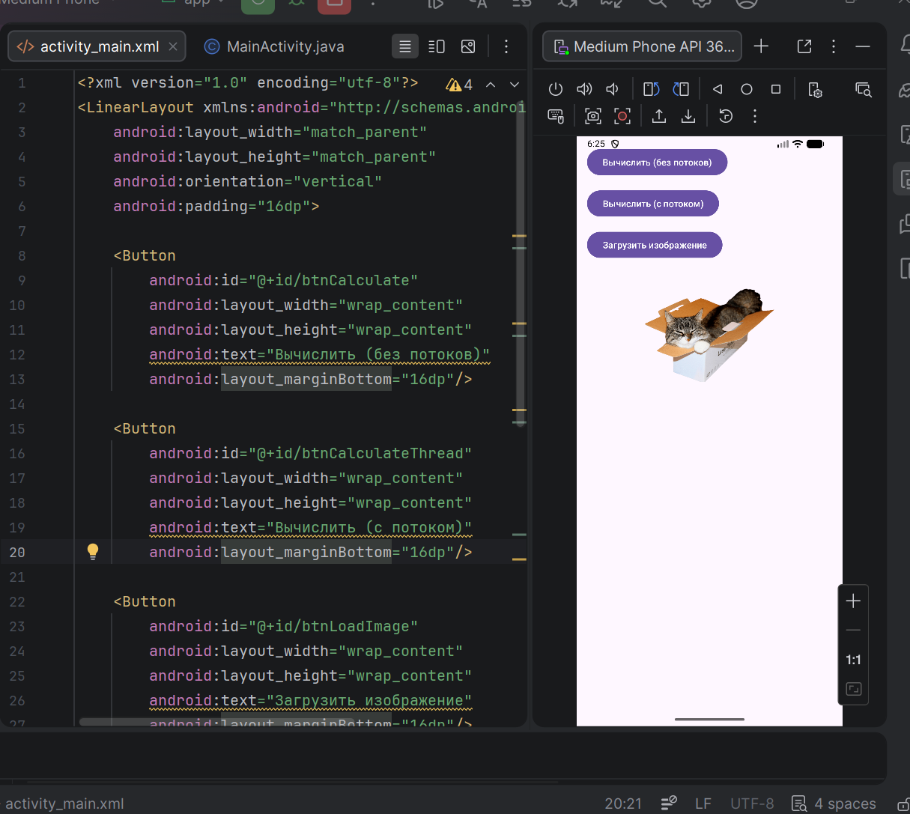
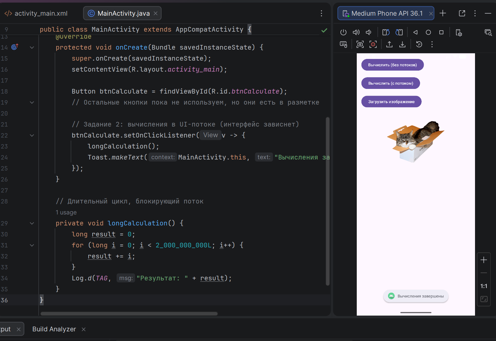
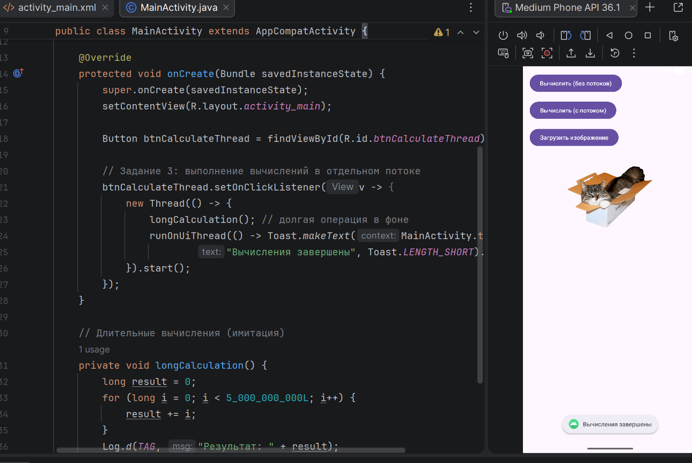
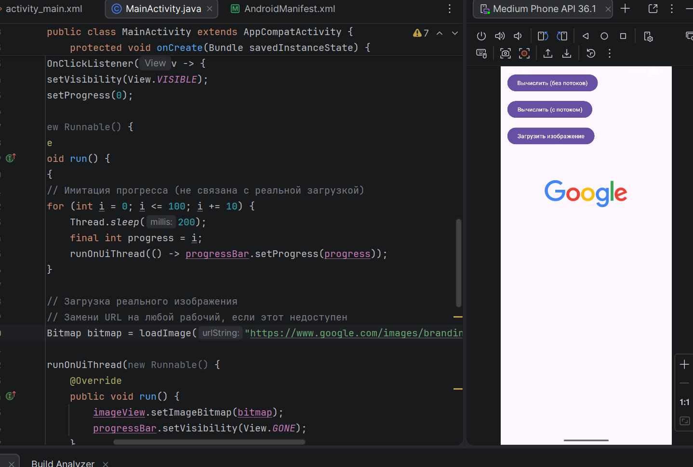
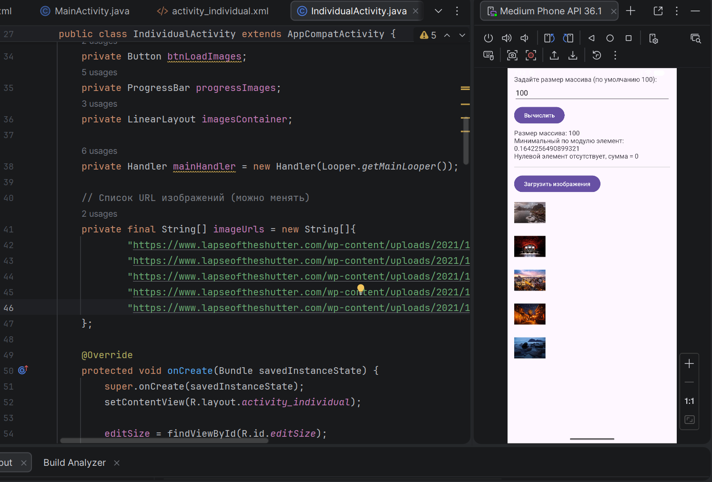

# Практическая работа №11: Многопоточность в Android. Асинхронная загрузка данных

**Выполнил:**  
Саньков Андрей Александрович  
Группа: ИНС-б-о-24-1  
Направление: 09.03.02 «Информационные системы и технологии»

---

## Цель работы

Изучить принципы многопоточного программирования в Android. Научиться выносить длительные операции (вычисления, загрузка данных из сети) в фоновые потоки, чтобы избежать блокировки пользовательского интерфейса. Освоить способы обновления UI из фоновых потоков.

---

## Ход работы

### Задание 1. Создание проекта и подготовка интерфейса

Создан проект `MultithreadingLab`. В `activity_main.xml` размещены три кнопки (демонстрация зависания, вычисления в потоке, загрузка изображения), `ProgressBar` и `ImageView`.



**Рисунок 1** — интерфейс


### Задание 2. Демонстрация «зависания» интерфейса

Реализован метод `longCalculation()` с тяжёлым циклом. При нажатии на кнопку «Вычислить (без потоков)» метод вызывается прямо в UI-потоке – интерфейс блокируется на несколько секунд.



**Рисунок 2** — «зависания» интерфейса

**Фрагмент кода:**
```java
private void longCalculation() {
    long result = 0;
    for (long i = 0; i < 2_000_000_000L; i++) result += i;
    Log.d(TAG, "Результат: " + result);
}

btnCalculate.setOnClickListener(v -> {
    longCalculation();
    Toast.makeText(this, "Вычисления завершены", Toast.LENGTH_SHORT).show();
});
```
### Задание 3. Выполнение вычислений в отдельном потоке
При нажатии на кнопку «Вычислить (с потоком)» вычисления запускаются в фоновом потоке. После завершения Toast показывается через runOnUiThread() – интерфейс не блокируется.



**Рисунок 3** — Выполнение вычислений в отдельном потоке
Фрагмент кода:

```java
btnCalculateThread.setOnClickListener(v -> {
    new Thread(() -> {
        longCalculation();
        runOnUiThread(() -> Toast.makeText(MainActivity.this, "Вычисления завершены", Toast.LENGTH_SHORT).show());
    }).start();
});
```
### Задание 4: Загрузка изображения из интернета с отображением прогресса



**Рисунок 4** — Загрузка изображения из интернета с отображением прогресса
Добавлено разрешение INTERNET в манифест. Реализована загрузка изображения по URL в фоновом потоке с имитацией прогресса (обновление ProgressBar). После загрузки картинка устанавливается в ImageView.
Фрагмент кода:
```java
private Bitmap loadImage(String urlString) throws IOException {
    URL url = new URL(urlString);
    HttpURLConnection conn = (HttpURLConnection) url.openConnection();
    conn.setDoInput(true);
    conn.connect();
    return BitmapFactory.decodeStream(conn.getInputStream());
}

btnLoadImage.setOnClickListener(v -> {
    progressBar.setVisibility(View.VISIBLE);
    new Thread(() -> {
        try {
            for (int i = 0; i <= 100; i += 10) {
                Thread.sleep(200);
                final int progress = i;
                runOnUiThread(() -> progressBar.setProgress(progress));
            }
            Bitmap bitmap = loadImage("https://www.google.com/images/branding/googlelogo/1x/googlelogo_color_272x92dp.png");
            runOnUiThread(() -> {
                imageView.setImageBitmap(bitmap);
                progressBar.setVisibility(View.GONE);
            });
        } catch (Exception e) {
            runOnUiThread(() -> {
                progressBar.setVisibility(View.GONE);
                Toast.makeText(MainActivity.this, "Ошибка загрузки", Toast.LENGTH_SHORT).show();
            });
        }
    }).start();
});
```
## Индивидуальное задание

Тема: «Помощник преподавателя» – фоновые вычисления и загрузка изображений.
Вариант: В одномерном массиве вещественных чисел вычислить:
а) минимальный по модулю элемент;
б) сумму модулей элементов, расположенных после первого элемента, равного нулю.
Дополнительно: загрузить несколько изображений из сети с отображением общего прогресса.

Работа выполнена в отдельной активности IndividualActivity.

Часть 1. Вычисления в фоновом потоке
Генерация массива случайных вещественных чисел заданного размера, расчёт требуемых характеристик и обновление индикатора прогресса выполняются в отдельном потоке. Для возврата результатов используется runOnUiThread().
```java
new Thread(() -> {
    double[] array = new double[size];
    Random random = new Random();
    for (int i = 0; i < size; i++) {
        array[i] = (random.nextDouble() * 20) - 10; // [-10, 10)
        Thread.sleep(20); // имитация длительной работы
        final int progress = (i + 1) * 100 / size;
        runOnUiThread(() -> progressBar.setProgress(progress));
    }

    // Минимальный по модулю элемент
    double minAbs = Math.abs(array[0]);
    for (double v : array) {
        double abs = Math.abs(v);
        if (abs < minAbs) minAbs = abs;
    }

    // Сумма модулей после первого нуля
    double sum = 0.0;
    boolean foundZero = false;
    for (double v : array) {
        if (foundZero) sum += Math.abs(v);
        else if (v == 0.0) foundZero = true;
    }

    final double finalMin = minAbs;
    final double finalSum = sum;
    runOnUiThread(() -> {
        progressBar.setVisibility(View.GONE);
        textResult.setText("Минимум по модулю: " + finalMin +
                           "\nСумма после нуля: " + (foundZero ? finalSum : 0));
    });
}).start();
```
Часть 2. Загрузка изображений с прогрессом
Изображения (5 штук) загружаются последовательно из заранее заданных URL. Каждое успешно загруженное изображение сразу добавляется в LinearLayout как новый ImageView. Общий прогресс (ProgressBar) показывает долю загруженных изображений.
```java
new Thread(() -> {
    String[] urls = {"https://picsum.photos/id/1/200/200", ...};
    for (int i = 0; i < urls.length; i++) {
        Bitmap bitmap = loadImage(urls[i]); // HttpURLConnection, BitmapFactory
        runOnUiThread(() -> {
            ImageView iv = new ImageView(context);
            iv.setImageBitmap(bitmap);
            imagesContainer.addView(iv);
        });
        int progress = (i + 1) * 100 / urls.length;
        runOnUiThread(() -> progressImages.setProgress(progress));
        Thread.sleep(300);
    }
    runOnUiThread(() -> progressImages.setVisibility(View.GONE));
}).start();
```


**Рисунок 5** — Индивидуальное задание
